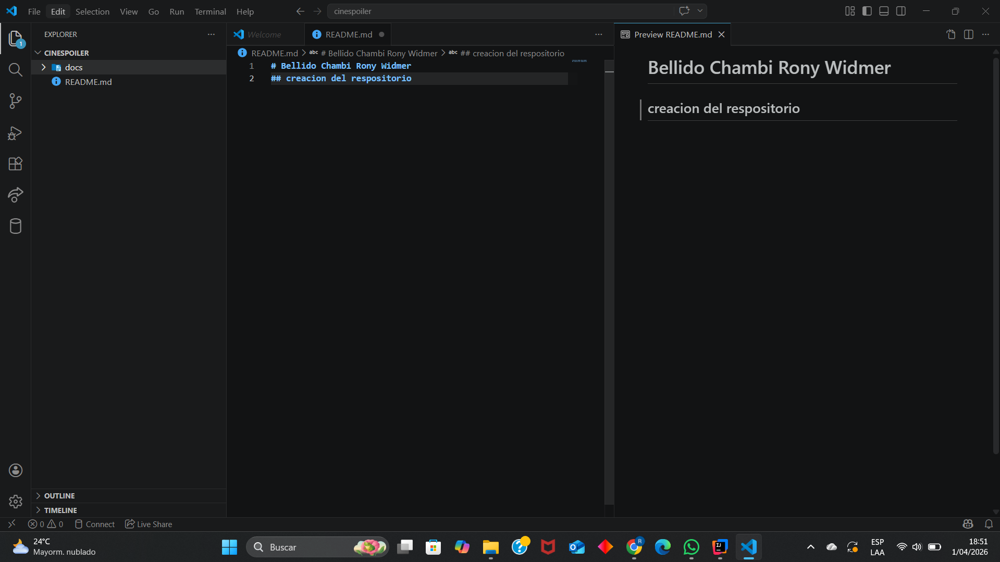
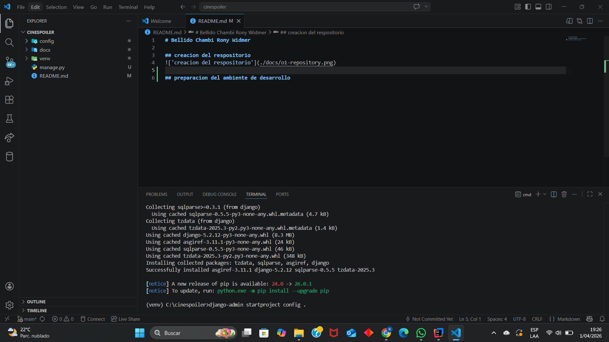
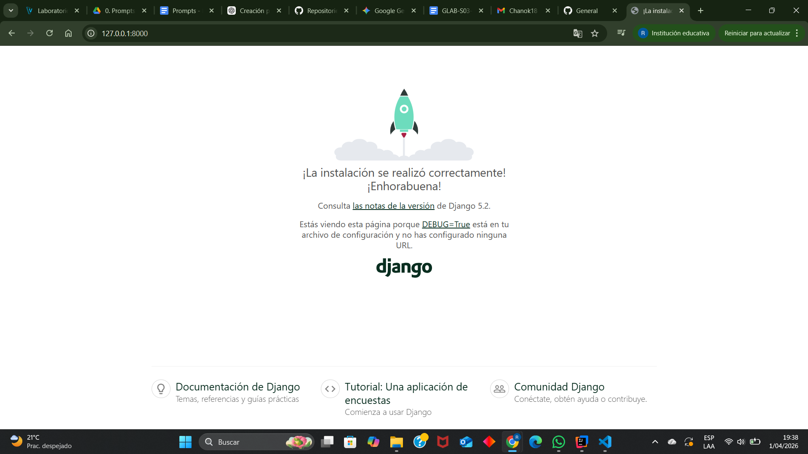
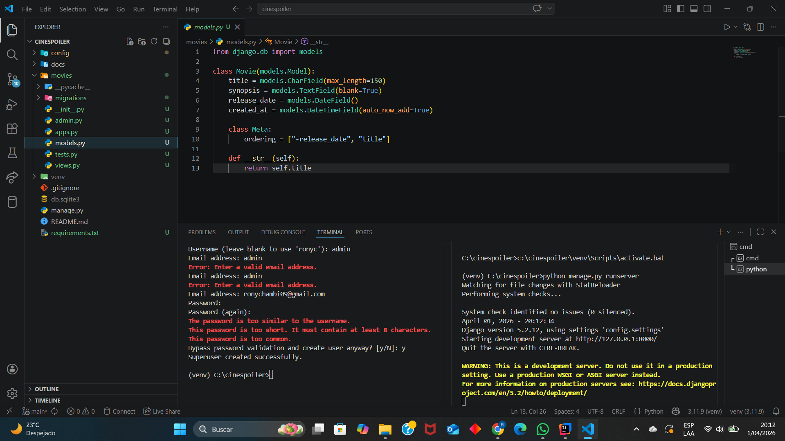
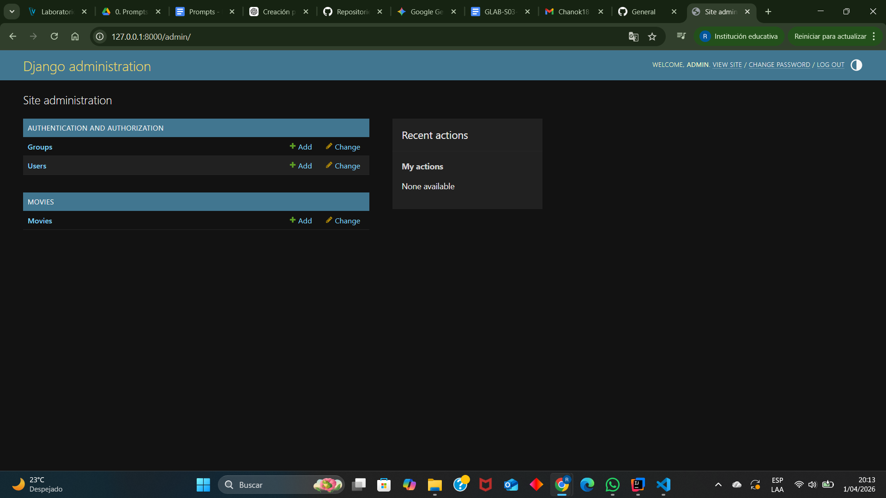
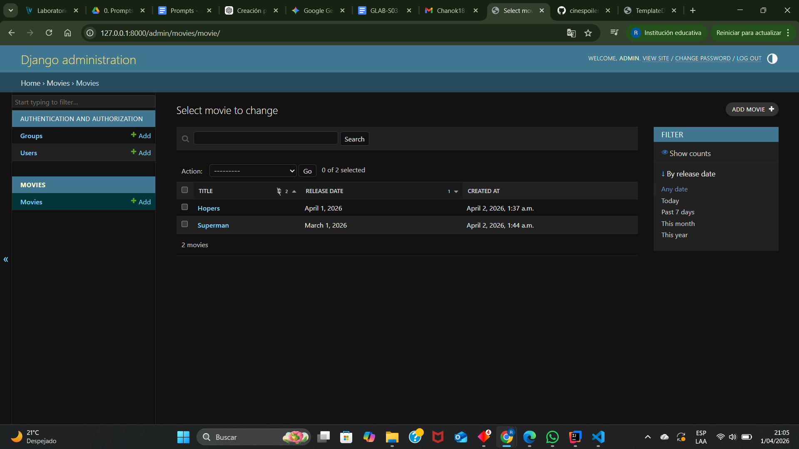

# Bellido Chambi Rony Widmer 

## creacion del respositorio 

## preparacion del ambiente de desarrollo

## ejecucion de la aplicación

## cración de primera aplicación 

## administrador de entidades

## Administrador de movies 

